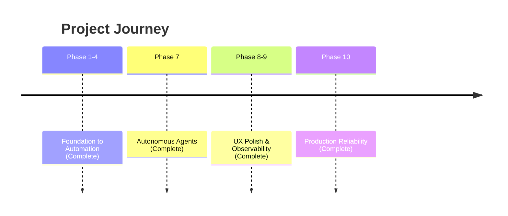

# Strategic Roadmap: Work (Local-First AI Engine)

## Vision
Build the world's most responsive, reliable, and intelligent productivity engine.

## Timeline

## Completed Phases ✅
- Phase 7: Autonomous Agents (Multi-agent swarms, self-correction)
- Phase 8: UX Polish (Agent Dashboard, Snackbars, Animations)
- Phase 9: Observability (114KB bundle, Global Agent Bar, Mobile CSS)
- Phase 10: Production Reliability (Error boundary, visible-first layout, immediate lane transition)

---

## Phase 11: Next Frontiers (Future)

### Ideas
| Feature | Description |
|---------|-------------|
| Offline-first sync | Background sync when connectivity restored |
| Collaborative editing | Real-time multi-user prompt collaboration |
| Template library | Pre-built prompt templates for common tasks |
| Analytics dashboard | Usage metrics and generation statistics |
| Voice input | Speech-to-text for prompt entry |
