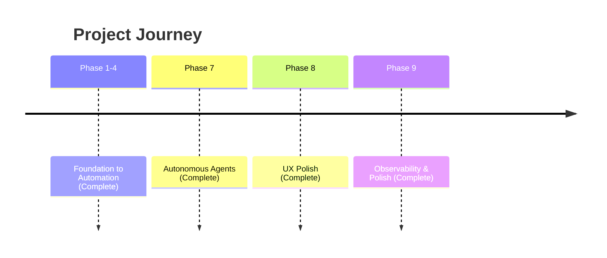

# Strategic Roadmap: Work (Local-First AI Engine)

## Vision
Build the world's most responsive, reliable, and intelligent productivity engine with local-first architecture and agentic AI.

## Timeline

## Completed Phases

### Phase 7: Autonomous Agents ✅
- Multi-Agent Orchestration (Coordinator/Worker swarms)
- Recursive Self-Correction (Critique loop)
- `decomposeAndDelegate()`, `synthesizeFromWorkers()`, `runWithCritique()`

### Phase 8: UX Polish ✅
- Agent Status Dashboard
- Snackbar notifications
- Micro-animations (slide-up, progress, modal-in)

### Phase 9: Observability & Polish ✅
- **Code Chunking**: Main bundle 114KB (down from 535KB)
- **Global Agent Bar**: Persistent progress at top
- **Interactive Loading**: StreamingText, SkeletonLoader
- **Mobile-Adaptive CSS**: Responsive layouts

## Bundle Analysis
| Chunk | Size |
|-------|------|
| index.js | 114KB |
| solid-vendor.js | 13.5KB |
| pglite.js | 393KB |
| ai-service.js | 4.3KB |
| memory-store.js | 4.7KB |
