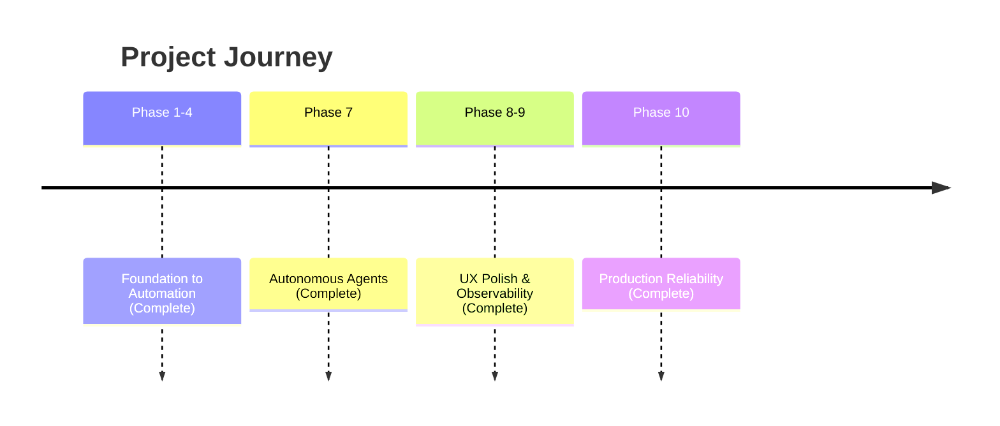

# Strategic Roadmap: Work (Local-First AI Engine)

## Vision
Build the world's most responsive, reliable, and intelligent productivity engine.

## Timeline

## Completed Phases ✅

### Phase 10: Production Reliability
- Error boundary for graceful error recovery
- Visible-first Playground layout (Prompt above System Instructions)
- Immediate lane transition on Run
- Presentation loading skeleton
- Auto-updating service worker (no hard refresh needed)
- Cache-control headers for optimal caching

### Phase 9: Observability
- 118KB main bundle (optimized chunking)
- Global Agent Bar for progress tracking
- Mobile-adaptive CSS

### Phase 8: UX Polish
- Agent Dashboard with real-time status
- Snackbar notifications
- Smooth animations

### Phase 7: Autonomous Agents
- Multi-agent swarms with Coordinator/Worker pattern
- Self-correcting AI with critique loops

---

### Phase 11: Templates, Sync & Diffing
- **Template Library**: Pre-built prompts for Coding, Writing, Analysis
- **Offline Sync**: Mutation queue with auto-retry
- **Version Diffing**: Side-by-side output comparison
- **Enhanced Version History**: Expandable panel with version cards

---

## Future Roadmap: The 50-Step Ascent

### 🧠 AI Engineering
1. **Model Comparison Arena**: Side-by-side output generation with diff highlighting.
2. **Historical Analysis**: "Improvement over time" tracking for prompt versions.
3. **Auto-Critique Loop**: Optional step where AI evaluates its own response before showing.
4. **Few-Shot Generator**: AI analyzes your prompt and suggests 3 examples to improve accuracy.
5. **Persona Library**: Save system instructions as reusable, shareable personae.
6. **Prompt Chaining**: Visually link Prompt A output to Prompt B input.
7. **Batch Runner**: Execute one prompt against a CSV dataset of variables.
8.  **Response Rating**: Binary (Thumbs Up/Down) or 5-star rating for fine-tuning datasets.
9.  **Token Estimation**: Real-time cost preview in the input editor.
10. **Semantic Search**: Find prompts not just by text, but by intent/meaning.

### ⚡️ Workflow & Productivity 
11. **Keyboard Shortcuts Engine**: Full navigation (`j`/`k`), run (`Cmd+Enter`), and command palette (`Cmd+K`).
12. **Markdown Toolbar**: Rich text controls in the prompt input area.
13. **Presentation Mode 2.0**: Live slideshow generation from prompt outputs.
14. **Focus Mode**: "Zen" toggle to hide sidebars and monitoring tools.
15. **Custom Status Columns**: User-defined Kanban workflow steps.
16. **WIP Limits**: Visual warnings when "Generating" column exceeds capacity.
17. **Scheduled Runs**: CRON-style triggers for periodic prompting.
18. **Prompt Forking**: Branch a prompt history into a new experimental card.
19. **Variable Highlighting**: Syntax highlighting for `{{variable}}` patterns.
20. **Quick-Copy Formats**: One-click copy as Markdown, HTML, or Plain Text.

### 🛡 Core & Data
21. **Auto-Tagging**: AI suggests tags based on prompt content.
22. **Conflict Resolution UI**: Visual merge tool for sync collisions.
23. **Board Export**: Full JSON/ZIP export for data portability.
24. **Board Import**: Drag-and-drop restore from backup files.
25. **Trash Can**: Soft delete with 30-day restore window.
26. **Selective Sync**: Toggle which boards sync to Cloudflare vs. Local-only.
27. **Encrypted Storage**: Optional AES-256 for sensitive local boards.
28. **Activity Log**: Immutable audit trail of prompt changes.
29. **OpFS Explorer**: Developer tool to inspect raw SQLite files.
30. **Mobile PWA Fit**: specialized CSS for dedicated mobile experience.

### 🔌 Integrations & API
31. **Webhook Triggers**: Run prompts via external POST requests.
32. **Email Ingestion**: Create/Run prompts from specific email aliases.
33. **Slack Bot**: Post finished generations to designated channels.
34. **Activity Log**: Immutable audit trail of prompt changes.
29. **OpFS Explorer**: Developer tool to inspect raw SQLite files.
30. **Mobile PWA Fit**: specialized CSS for dedicated mobile experience.
36. **API Bearer Tokens**: Generate keys for third-party app access.
37. **Plugin Sandbox**: TypeScript runtime for user-contributed logic.
38. **Custom Renderers**: React components to visualize specific JSON outputs.
39. **Mermaid.js Native**: Auto-render diagrams in chat outputs.
40. **LaTeX Math**: MathJax support for scientific prompting.

### 📊 Insight & Analytics
41. **Cost Budgeting**: set daily/monthly dollar limits with alerts.
42. **Token Heatmap**: Calendar view of usage intensity.
43. **Model ROI**: "Quality vs Cost" scatter plot based on user ratings.
44. **Latency Histogram**: Distribution of generation times.
45. **Error Taxonomy**: Categorized breakdown of failure modes (Timeout vs Safety).
46. **Export Reports**: PDF generation of monthly usage/insights.
47. **A/B Testing**: Randomly serve Version A or B to measure performance.
48. **User Roles**: Viewer/Editor/Admin permissions for shared boards.
49. **Docker Self-Host**: One-line deploy for private infrastructure.
50. **Global Search**: `Cmd+P` to jump to any prompt across all boards.
