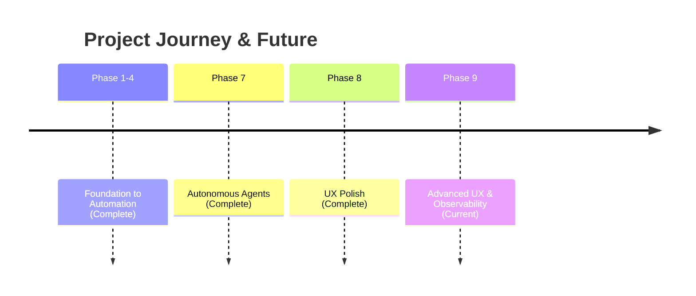

# Strategic Roadmap: Work (Local-First AI Engine)

## 1. Vision & Strategy
Our mission is to build the world's most responsive, reliable, and intelligent productivity engine.

## 2. Visual Timeline

## 3. Phase 9: Advanced UX & Observability (Next)

**Based on visual testing insights:**

### 🌳 Agent Orchestration Tree View
- Real-time hierarchical view of Coordinator → Workers
- Inline status updates within the prompt card

### 📐 Side-Panel Editor
- Replace modal with collapsible right panel
- Keep board context visible during editing

### 📊 Granular Progress Feedback
- "Thinking Trace" stages: Decomposing → Delegating → Synthesizing
- Live token counter and estimated time

### 🛡 Resilient Error Handling
- Global error toast with "Retry" and "Show Logs" options
- Timeout fallbacks for stuck agents

### 📚 Interactive Prompt Templates
- Quick-start gallery: Research Assistant, Code Reviewer, etc.
- Empty-state onboarding with template picker

### 🔴 Live Preview Mode
- Real-time streaming output in presentation view
- No need to wait for full completion
