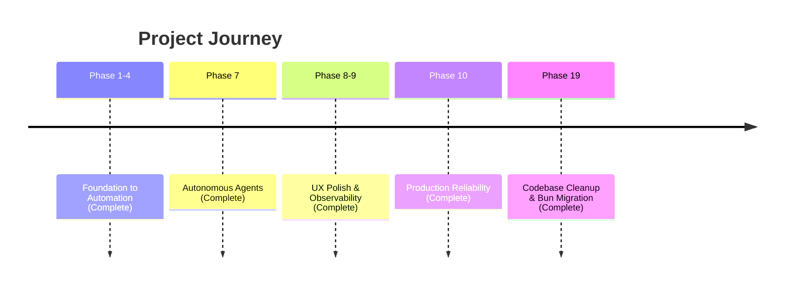

# Strategic Roadmap: Work (Local-First AI Engine)

## Vision

Build the world's most responsive, reliable, and intelligent productivity engine.

## Timeline

## Completed Phases ✅

### Phase 10: Production Reliability

- Error boundary for graceful error recovery
- Visible-first Playground layout (Prompt above System Instructions)
- Immediate lane transition on Run
- Presentation loading skeleton
- Auto-updating service worker (no hard refresh needed)
- Cache-control headers for optimal caching

### Phase 9: Observability

- 118KB main bundle (optimized chunking)
- Global Agent Bar for progress tracking
- Mobile-adaptive CSS

### Phase 7: Autonomous Agents
- [x] Epistemic Analyst integration (Telegram)
- [x] Deep Research capabilities

### Phase 20: Smart Automation
- **Scheduled Prompts**: Cron-based recurring execution
- **Triggered Workflows**: Event-driven prompt chains (Card Add/Move/Tag)
- **Library Integration**: Save and reuse prompts independent of Kanban cards

---

### Phase 11: Templates, Sync & Diffing

- **Template Library**: Pre-built prompts for Coding, Writing, Analysis
- **Offline Sync**: Mutation queue with auto-retry
- **Version Diffing**: Side-by-side output comparison
- **Enhanced Version History**: Expandable panel with version cards

---

## Future Roadmap: Selected Commitments

### 🧠 AI Engineering

1. **Auto-Critique Loop**: Optional step where AI evaluates its own response before showing.
3. **Historical Analysis**: "Improvement over time" tracking for prompt versions.
4. **Few-Shot Generator**: AI analyzes your prompt and suggests 3 examples to improve accuracy.
5. **Persona Library**: Save system instructions as reusable, shareable personae.
6. **Prompt Chaining**: Visually link Prompt A output to Prompt B input.
7. **Batch Runner**: Execute one prompt against a CSV dataset of variables.
8. **Response Rating**: Binary (Thumbs Up/Down) or 5-star rating for fine-tuning datasets.
9. **Token Estimation**: Real-time cost preview in the input editor.
10. **Semantic Search**: Find prompts not just by text, but by intent/meaning.
11. **Auto-Tagging**: AI suggests tags based on prompt content.

### ⚡️ Workflow, Data & Integrations

12. **WIP Limits**: Visual warnings when "Generating" column exceeds capacity.
13. **Prompt Forking**: Branch a prompt history into a new experimental card.
14. **Variable Highlighting**: Syntax highlighting for `{{variable}}` patterns.
15. **Quick-Copy Formats**: One-click copy as Markdown, HTML, or Plain Text.
16. **Conflict Resolution UI**: Visual merge tool for sync collisions.
17. **Board Export**: Full JSON/ZIP export for data portability.
18. **Board Import**: Drag-and-drop restore from backup files.
19. **Trash Can**: Soft delete with 30-day restore window.
20. **Activity Log**: Immutable audit trail of prompt changes.
21. **OpFS Explorer**: Developer tool to inspect raw SQLite files.
22. **Mobile PWA Fit**: Specialized CSS for dedicated mobile experience.
