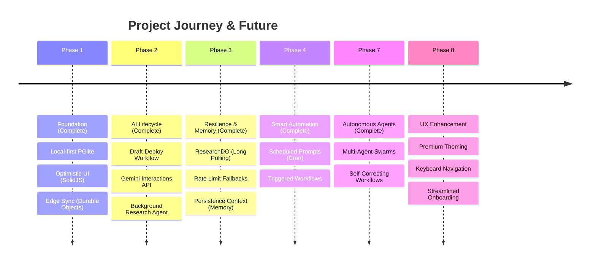

# Strategic Roadmap: Work (Local-First AI Engine)

## 1. Vision & Strategy
Our mission is to build the world's most responsive, reliable, and intelligent productivity engine. By combining **local-first architecture** with **agentic AI capabilities**, we provide a professional workspace that works offline, syncs instantly at the edge, and automates complex cognitive tasks.

## 2. Visual Timeline

## 3. Detailed Development Tracks

### ✅ Completed Phases
- **Phase 1-4:** Foundation, AI Lifecycle, Resilience & Memory, Smart Automation.
- **Phase 7:** Autonomous Agents (Multi-Agent Orchestration, Recursive Self-Correction).

---

### 🎨 Phase 8: UX Enhancement (New Focus)
**Goal:** Elevate the user experience to a premium, professional standard.

- [ ] **Premium Theming System**
    - Light/Dark/System modes with smooth transitions.
    - Customizable accent colors per board.
    - High-contrast accessibility mode.

- [ ] **Keyboard-First Navigation**
    - Full keyboard shortcuts for prompt creation, execution, and navigation.
    - Vim-like keybindings mode (optional).
    - Command Palette (⌘+K) for instant actions.

- [ ] **Streamlined Onboarding**
    - Interactive walkthrough for first-time users.
    - Empty-state illustrations and quick-start templates.
    - Contextual help tooltips.

- [ ] **Agent Status Dashboard**
    - Real-time visual progress for running agents.
    - Collapsible worker task panel for coordinators.
    - Live token usage and execution time display.

- [ ] **Polished Interactions**
    - Micro-animations for drag-and-drop.
    - Snackbar notifications for background events.
    - Optimistic feedback on all actions (buttons, saves).

## 4. Current Progress (KPIs)

| Metric | Status | Target |
|--------|--------|--------|
| **UI Latency** | ✅ < 16ms | < 16ms |
| **Offline Sync** | ✅ Robust | 100% |
| **AI Reliability** | ✅ Improving | 99.9% Success |
| **Agent Support** | ✅ Multi-Agent | Swarm Orchestration |
| **Context Retention**| ✅ In Dev | Cross-session Memory |

---

> [!TIP]
> This roadmap is dynamic and evolves based on user feedback and advancements in the Gemini model ecosystem. We prioritize **performance**, **privacy**, and **premium UX** in every feature.
