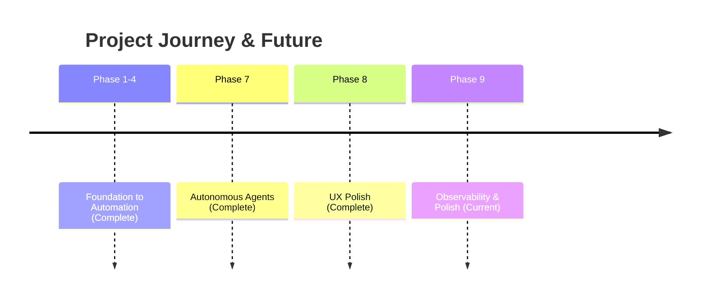

# Strategic Roadmap: Work (Local-First AI Engine)

## 1. Vision & Strategy
Build the world's most responsive, reliable, and intelligent productivity engine.

## 2. Visual Timeline

## 3. Phase 9: Observability & Polish (Current)

**From visual testing insights:**

### 🔄 Reactive Board Lanes
- Auto-move cards between lanes (Draft → Generating → Deployed) based on execution state

### � Global Agent Bar  
- Persistent progress indicator at top/bottom of Board view
- Track background tasks without opening Playground

### 🌊 Interactive Loading States
- Streaming-text effect in output preview
- Skeleton loaders in Presentation mode

### � Contextual Agent Logs
- Expandable mini-log in Agent Dashboard
- Show "Decomposing...", "Synthesizing..." stages

### � Mobile-Adaptive Playground
- Stacked/tabbed layout for mobile and tablet

### ⌨️ Keyboard Shortcuts Onboarding
- Subtle tooltips promoting ⌘+Enter, ⌘+S, Esc

### � Board-Playground Sync
- Lane counts update in real-time during generation
