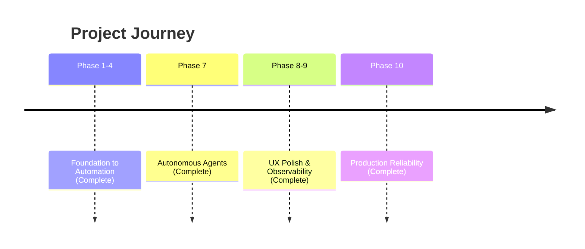

# Strategic Roadmap: Work (Local-First AI Engine)

## Vision
Build the world's most responsive, reliable, and intelligent productivity engine.

## Timeline

## Completed Phases ✅

### Phase 10: Production Reliability
- Error boundary for graceful error recovery
- Visible-first Playground layout (Prompt above System Instructions)
- Immediate lane transition on Run
- Presentation loading skeleton
- Auto-updating service worker (no hard refresh needed)
- Cache-control headers for optimal caching

### Phase 9: Observability
- 118KB main bundle (optimized chunking)
- Global Agent Bar for progress tracking
- Mobile-adaptive CSS

### Phase 8: UX Polish
- Agent Dashboard with real-time status
- Snackbar notifications
- Smooth animations

### Phase 7: Autonomous Agents
- Multi-agent swarms with Coordinator/Worker pattern
- Self-correcting AI with critique loops

---

### Phase 11: Templates, Sync & Diffing
- **Template Library**: Pre-built prompts for Coding, Writing, Analysis
- **Offline Sync**: Mutation queue with auto-retry
- **Version Diffing**: Side-by-side output comparison
- **Enhanced Version History**: Expandable panel with version cards

---

## Phase 12: Analytics & Media (Future)

### Ideas
| Feature | Description |
|---------|-------------|
| **Analytics Dashboard** | Usage metrics (tokens, latency), cost estimation |
| **Schema Sync** | Ensure server DB schema matches client for robust sync |
| **Media Attachments** | R2 uploads for images/docs in prompts |
| **Voice Input** | Speech-to-text for fast prompting |
| **Collaborative Editing** | Real-time multi-user cursor presence |
