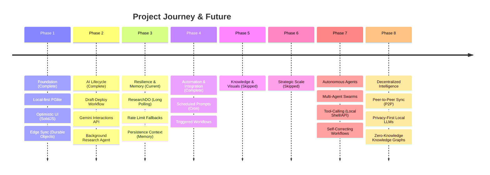

# Strategic Roadmap: Work (Local-First AI Engine)

## 1. Vision & Strategy
Our mission is to build the world's most responsive, reliable, and intelligent productivity engine. By combining **local-first architecture** with **agentic AI capabilities**, we provide a professional workspace that works offline, syncs instantly at the edge, and automates complex cognitive tasks.

## 2. Visual Timeline

## 3. Detailed Development Tracks

### 🛠 Phase 4: Smart Automation (Complete)
**Goal:** Transition from passive prompting to active workflows.
- [x] **Scheduled Prompts:** Cron-style execution within `BoardDO` for recurring intelligence tasks.
- [x] **Triggered Workflows:** Automated prompt execution based on board events.
- [s] **Output Pipelines:** (Skipped per user request)

### ⏩ Phase 5: Knowledge Engine & Visuals (Skipped)
**Goal:** Deepen the utility of AI outputs and visual representation.
- [ ] **RAG Integration:** Vector-based search over user-uploaded documents for high-accuracy context.
- [ ] **Knowledge Graphs:** Visual mapping of relationships between prompts, memories, and outputs.
- [ ] **Presentation Mode:** Convert AI outputs directly into slide decks or structured documents.
- [ ] **Multimodal Visuals:** Integrated image generation (Imagen) and diagram creation (Mermaid).

### ⏭ Phase 6: Strategic Scale (Skipped)

### 🤖 Phase 7: Autonomous Agents (New Focus)
**Goal:** Transition from user-triggered prompts to self-driving agent swarms.
- [ ] **Multi-Agent Orchestration:** Prompts that can spawn and coordinate sub-prompts for complex research.
- [ ] **Native Tool Use:** AI agents with the ability to execute local shell commands or call external APIs autonomously.
- [ ] **Recursive Self-Correction:** Feedback loops where AI evaluates its own output against constraints before final delivery.

### 🌐 Phase 8: Decentralized Intelligence
**Goal:** Remove the central server while maintaining global collaborative intelligence.
- [ ] **P2P Sync Protocol:** Direct list-to-list synchronization using Yjs or Automerge without intermediate Durable Objects.
- [ ] **Local-LLM Native:** First-class support for running quantized models (Llama3/Gemma) directly in the browser via WebGPU.
- [ ] **Zero-Knowledge Context:** Encrypted knowledge graphs where the AI processes data locally, ensuring 100% data sovereignty.

## 4. Current Progress (KPIs)

| Metric | Status | Target |
|--------|--------|--------|
| **UI Latency** | ✅ < 16ms | < 16ms |
| **Offline Sync** | ✅ Robust | 100% |
| **AI Reliability** | 🟡 Improving | 99.9% Success |
| **Agent Support** | ✅ 1-hour Tasks | Support Hour+ Polling |
| **Context Retention**| 🔲 In Dev | Cross-session Memory |

---

> [!TIP]
> This roadmap is dynamic and evolves based on user feedback and advancements in the Gemini model ecosystem. We prioritize **performance** and **privacy** in every feature.
