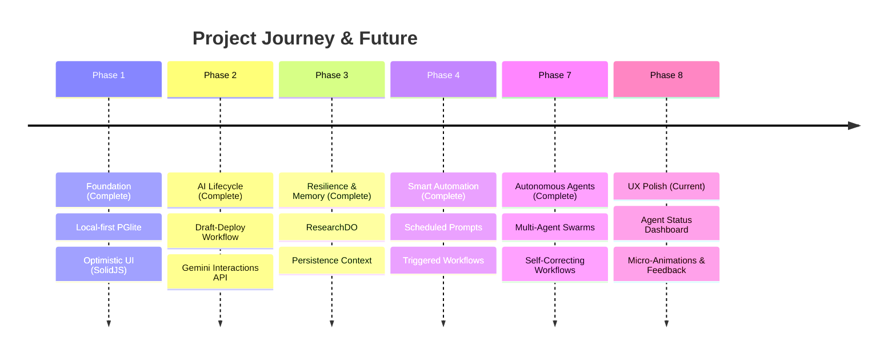

# Strategic Roadmap: Work (Local-First AI Engine)

## 1. Vision & Strategy
Our mission is to build the world's most responsive, reliable, and intelligent productivity engine. By combining **local-first architecture** with **agentic AI capabilities**, we provide a professional workspace that works offline, syncs instantly at the edge, and automates complex cognitive tasks.

## 2. Visual Timeline

## 3. Phase 8: UX Polish (Current Focus)

### 🎯 Agent Status Dashboard
- Real-time visual progress for running agents
- Collapsible worker task panel for coordinators
- Live token usage and execution time display

### ✨ Polished Interactions
- Micro-animations for drag-and-drop
- Snackbar notifications for background events
- Optimistic feedback on all actions (buttons, saves)

## 4. Current Progress (KPIs)

| Metric | Status | Target |
|--------|--------|--------|
| **UI Latency** | ✅ < 16ms | < 16ms |
| **Offline Sync** | ✅ Robust | 100% |
| **AI Reliability** | ✅ Improving | 99.9% Success |
| **Agent Support** | ✅ Multi-Agent | Swarm Orchestration |

---

> [!TIP]
> This roadmap prioritizes **performance**, **privacy**, and **premium UX**.
