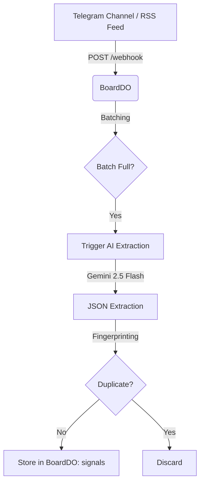
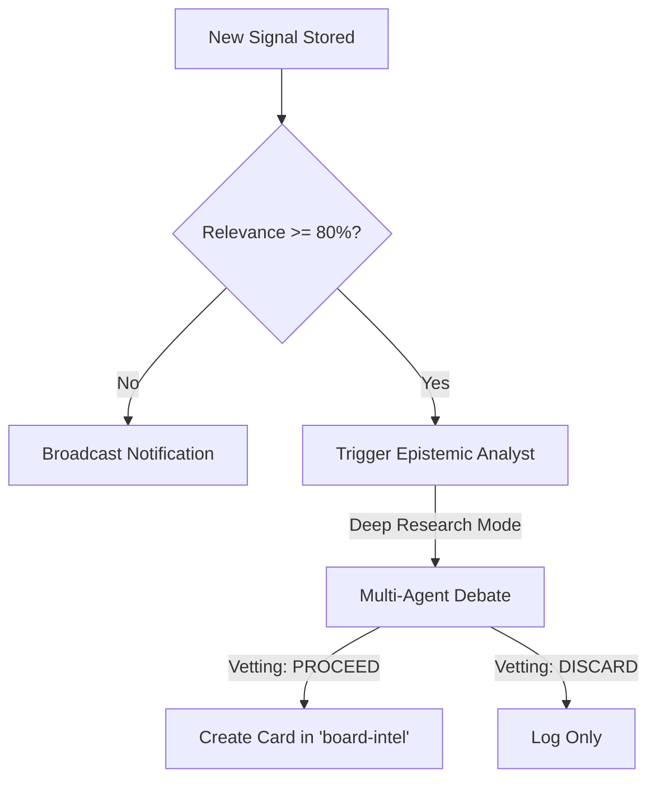

# System Workflows: Content Refinery & Intelligence Engine

This document outlines the core automated workflows implemented within the **Work** (Local-First Kanban) ecosystem, specifically focusing on the **Content Refinery** pipeline.

## 1. Signal Ingestion & Extraction Workflow

This workflow handles the transition from raw unstructured data to structured market intelligence.

-   **Trigger**: Inbound HTTP POST to `/api/telegram/webhook` or `/api/refinery/rss`.
-   **Extraction**: AI extracts `summary`, `sentiment`, `tickers`, and `relevance`.
-   **Persistence**: Signals are stored persistently in the SQLite `signals` table in `BoardDO`.
-   **Deduplication**: SHA-256 fingerprinting prevents processing the same news twice within a 6-hour window.

---

## 2. Epistemic Vetting & Autonomous Routing

High-relevance signals undergo a deeper vetting process before becoming actionable Kanban cards.

-   **Analyst**: The `ResearchDO` acts as an "Epistemic Analyst" with "Relational Context" (access to previous signals).
-   **Criteria**: Only signals validated as "PROCEED" are elevated to the Kanban board.
-   **Routing**: Cards are automatically sent to the **Market Intelligence** board (`board-intel`) in the **Hot Signals** list (`list-intel-todo`).

---

## 3. Knowledge Graph Augmentation

Every signal processed strengthens the institutional knowledge graph.

-   **Entity Linkage**: Tickers (e.g., `$AAPL`, `$TSLA`) are extracted and upserted as `TICKER` entities.
-   **Relationship Mapping**: A `MENTIONS` relationship is created between the Signal ID and the Ticker ID.
-   **Weighting**: The `strength` of the relationship is scaled by the signal's `relevance`.
-   **Usage**: The Graph serves as context for future vetting and research sessions.

---

## 4. Daily Briefing & Synthesis Workflow

A recurring process that provides high-level summaries for administrators.

-   **Trigger**: Cron schedule (Daily at 09:00 UTC) or manual tick.
-   **Synthesis**: Queries all signals from the last 24 hours.
-   **Agent**: `ResearchDO` acts as a "Senior Market Strategist" to synthesize technical alpha.
-   **Delivery**: Broadcasts a formatted Markdown report to all registered Telegram admins.

---

## 5. Multi-Board Synchronization Workflow

Ensures real-time updates across specialized views.

-   **Board Switching**: Frontend sends `SWITCH_BOARD` message to `BoardDO`.
-   **State Isolation**: `BoardDO` filters `lists` and `cards` by `board_id` and sends a fresh `SYNC_STATE`.
-   **Collaborative Sync**: SQL results are broadcasted only to users currently viewing the same board ID.
